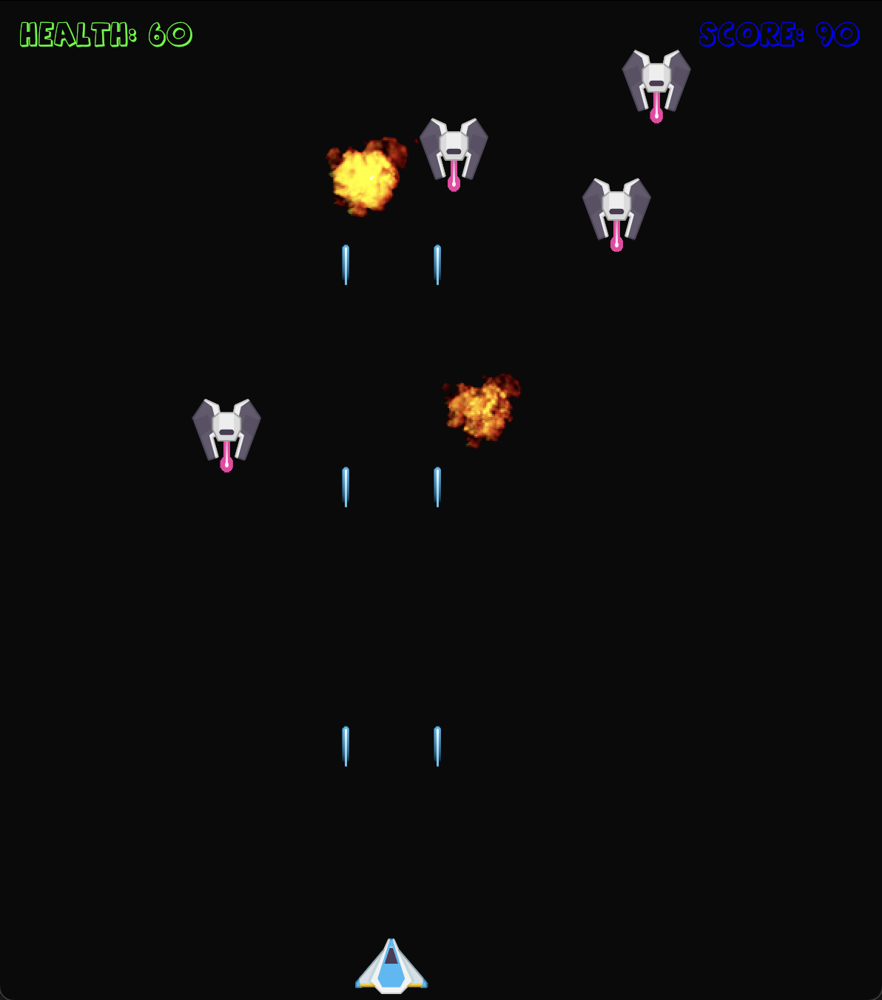

Space Invaders with Bevy
===
The goal of this project is to create a Space Invaders type project with Bevy. It is an ongoing project and its main purpose is to learn more about the Bevy Engine and it's feature, while havin fun with it of course.

### Requirements
Before you begin, ensure you have met the following requirements:
* Rust (latest stable) – [How to install Rust](https://www.rust-lang.org/en-US/install.html)
* Whatever is on the Cargo.toml

## Project Progress
*Not checked means I am currently working on.*
- [x] Player setup and movement component
- [x] Player Input
- [x] Implemented firing system and moving lasers
- [x] Spawn two lasers and despawn them once they get of screen
- [x] Enemy spawn, collision and explosion animation
- [x] Enemy respawning at random
- [x] Enemy firing system
- [x] Player explosion and respawing after some time
- [x] Enemy movement in spiral formation
- [x] Implement attribute system with health player
- [x] Implement Pause on pressing P
- [x] Implement score system
- [ ] Play sound on fire and explosion

### Roadmap
Features that are in the roadmap of the project:

*Ideally in order of priority, but nothing set in stone.*

- [ ] Not let player get off screen when moving
- [ ] Add damage setting to laser
- [ ] Add score value to enemy (different enemies can have different scores)
- [ ] Add UI elements to screen
  - [ ] Health bar
  - [ ] Ammo bar 
  - [ ] Score
- [ ] Implement main menu with Play and Quit options
- [ ] Implement different enemies with different formations

